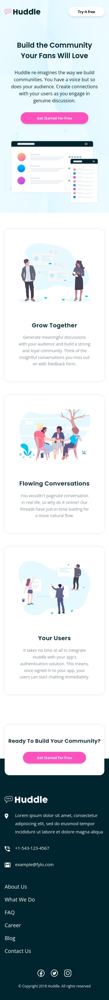

# Frontend Mentor - Huddle landing page with alternating feature blocks solution

This is a solution to the [Huddle landing page with alternating feature blocks challenge on Frontend Mentor](https://www.frontendmentor.io/challenges/huddle-landing-page-with-alternating-feature-blocks-5ca5f5981e82137ec91a5100). Frontend Mentor challenges help you improve your coding skills by building realistic projects.

## Table of contents

-   [Overview](#overview)
    -   [The challenge](#the-challenge)
    -   [Screenshot](#screenshot)
    -   [Links](#links)
-   [Built with](#built-with)
-   [Author](#author)

## Overview

### The challenge

Users should be able to:

-   View the optimal layout for the site depending on their device's screen size
-   See hover states for all interactive elements on the page

### Screenshot

  

### Links

-   Solution URL: [https://www.frontendmentor.io/solutions/huddle-landing-page-using-tailwind-css-6sh6dpg-8](https://www.frontendmentor.io/solutions/huddle-landing-page-using-tailwind-css-6sh6dpg-8)
-   Live Site URL: [https://sissokho.github.io/frontendmentor-huddle-landing-page/](https://sissokho.github.io/frontendmentor-huddle-landing-page/)

## Built with

-   Semantic HTML5 markup
-   Tailwind CSS
-   Flexbox
-   CSS Grid
-   Mobile-first workflow

## Author

-   Frontend Mentor - [@sissokho](https://www.frontendmentor.io/profile/sissokho)
-   Twitter - [@mm_sissokho](https://twitter.com/mm_sissokho)
-   Linkedin - [Mouhamadou Moustapha SISSOKHO](https://www.linkedin.com/in/mouhamadou-moustapha-sissokho-548a55125/)
